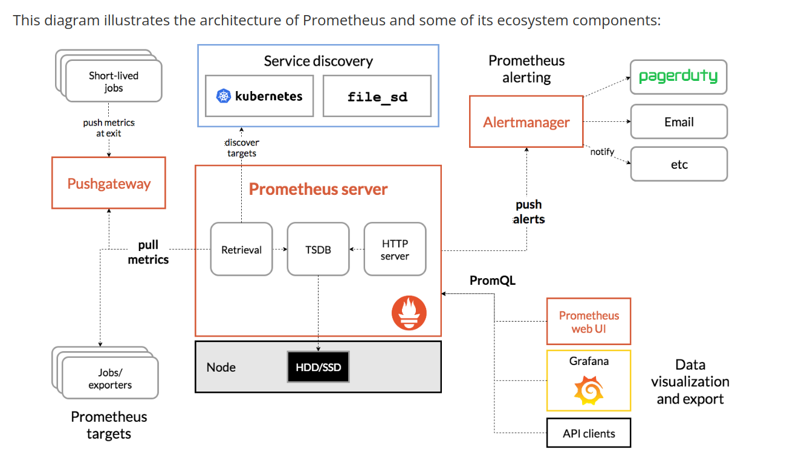

# Prometheus

## Table of Contents

1. [Prometheus](#prometheus)
2. [Introduction](#Introduction)
3. [Prometheus Features](#prometheus-features)
4. [Prometheus Components](#prometheus-components)
5. [Prometheus Architecture](#prometheus-architecture)
6. [How Prometheus Works](#how-prometheus-works)
7. [What Can You Monitor with Prometheus?](#what-can-you-monitor-with-prometheus)
	- [Service Metrics](#service-metrics)
	- [Host Metrics](#host-metrics)
	- [Website Uptime/Up Status](#website-uptimeup-status)
	- [Cronjobs](#cronjobs)
8. [Prometheus Metric Types](#prometheus-metric-types)
	- [Counter](#counter)
	- [Gauge](#gauge)
	- [Histogram](#histogram)
	- [Summary](#summary)
9. [What Are the Use Cases of Prometheus?](#what-are-the-use-cases-of-prometheus)
10. [When Not to Use Prometheus?](#when-not-to-use-prometheus)
11. [Best Practices for Prometheus Monitoring](#best-practices-for-prometheus-monitoring)
	- [Choose the Best Exporter](#choose-the-best-exporter)
	- [Label Carefully](#label-carefully)
	- [Set Actionable Alerts](#Set-Actionable-Alerts)
12. [References](#References)

## Introduction

Monitoring and Observability are crucial for maintaining the health, performance, and availability of modern, complex systems. These systems often consist of multiple components, services, and infrastructure layers, and it can be challenging to understand the interactions between these components and identify the root cause of problems when they occur.
Prometheus is an open-source tool that’s meant to monitor and collect metrics from applications. Prometheus provides a unified solution for collecting and storing metrics and generating alerts, which makes it easier to monitor and understand complex systems. The point of this system is to make it easy for users to see and understand important metrics that let them know how well an application is doing. In fact, Prometheus is able to collect over one million metrics per second, and then store them until you’re ready to retrieve them. Additionally, Prometheus’ query language and Grafana integration make it possible to visualize and analyze metrics over time, which helps to identify trends and patterns that may indicate potential issues.

## Prometheus Features

- A multi-dimensional data model with time series data identified by metric name and key/value pairs. This model allows flexibility in organizing and querying metrics based on various dimensions like job, instance, and labels, enabling detailed analysis.
- PromQL- a flexible query language to leverage this dimensionality to slice and dice collected time series data, allowing flexibility in monitoring diverse systems and services.
- no reliance on distributed storage - All single server nodes are autonomous
- Pull model – time series collection happens via a pull model over HTTP
- pushing time series is supported via an intermediary gateway, also supports metrics collection from short-lived jobs
- targets are discovered via service discovery or static configuration
- Visualization - smultiple modes of graphing and dashboarding support.

## Prometheus Components

The Prometheus ecosystem consists of multiple components, many of which are optional:

- the main Prometheus server which scrapes and stores time series data
- client libraries for instrumenting application code
- a push gateway for supporting short-lived jobs
- special-purpose exporters for services like HAProxy, StatsD, Graphite, etc.
- an alertmanager to handle alerts
- various support tools

## Prometheus Architecture

Prometheus  architecture is built with several key components that work together to collect, store, and process metrics (data) from various systems. Let’s break down each component in simple terms:

1. **Prometheus Server**:
**What it does:** This is the heart of the Prometheus architecture. It scrapes (collects) metrics from different targets (like servers, applications, or databases) at regular intervals.
**How it works:** The Prometheus server periodically pulls data from these targets and stores it in its own time-series database. It also provides a way to query the stored data using a language called PromQL.

2. **Service Discovery:**
**What it does:** Instead of manually telling Prometheus where all the targets (servers, apps) are, service discovery helps Prometheus automatically find them.
**How it works:** It can integrate with systems like Kubernetes, AWS, or static configurations to automatically discover new services or instances that should be monitored.

3. **Pushgateway:**
**What it does:** Prometheus usually pulls (scrapes) data from targets, but some jobs (like short-lived batch jobs) don't run long enough to be scraped. This is where the Pushgateway comes in.
**How it works:** These jobs push their metrics to the Pushgateway, which then holds on to the data so Prometheus can scrape it later.

4. **Prometheus Web UI:**
**What it does:** This is a simple web interface that comes with Prometheus.
**How it works:** Through the UI, you can visualize the collected metrics, run queries using PromQL, and get an overview of the current state of your targets.

5. **Alertmanager:**
**What it does:** While Prometheus can detect issues (like high CPU usage), the Alertmanager handles what happens after a problem is detected. It manages alerts (notifications) and can group, silence, or route them to different destinations (e.g., Slack, email).
**How it works:** Prometheus server sends alerts to the Alertmanager based on rules you set. The Alertmanager then decides how to notify you based on your configuration.

6. **Exporters:**

**What they do:** Most systems (like databases or applications) don’t speak Prometheus' language natively. Exporters act as translators, converting the system's data into a format that Prometheus understands.
**How they work:** For example, the Node Exporter collects metrics from Linux systems (like CPU and memory usage) and makes it available for Prometheus to scrape.

7. **Time-series Database:**
**What it does:** This is part of the Prometheus server where all the metrics are stored.
**How it works:** Each metric is stored with a timestamp, and Prometheus can store huge amounts of time-stamped data. You can query this historical data later to analyze trends.

## How Prometheus Works 

Prometheus gets a metric from an exposed HTTP endpoint. A number of client libraries are available to provide this application integration when building software. With an available endpoint, Prometheus can scrape numerical data and store it as a time series in a local time-series database. It can also integrate with remote storage options.s
In addition to the stored time series, impermanent times series from the source are produced by queries. These series are recognized by metric name and key-value pairs known by labels. Queries are generated using PromQL (Prometheus Query Language) that enables users to choose and aggregate time-series data in real-time. PromQL is also used to establish alert conditions that can then transmit notifications outside sources such as PagerDuty, Slack or email.  These data can be displayed in graph or tabular form in Prometheus’s Web UI. Alternatively, and commonly, API integrations with alternative display solutions such as Grafana may be used.

**Example:**
Imagine you have a web application. Prometheus can monitor its CPU, memory, and response times by scraping an exporter. If response times exceed a threshold, an alert is triggered, and the Alertmanager sends you a Slack notification. You can check the Prometheus Web UI to see the metrics in real-time or investigate historical data to understand the issue.

## What Can You Monitor with Prometheus?

Prometheus is a versatile monitoring tool, which you can use to monitor a variety of infrastructure and application metrics. Here are a few common use cases.

### Service Metrics

Prometheus is typically used to collect numeric metrics from services that run 24/7 and allow metric data to be accessed via HTTP endpoints. This can be done manually or with various client libraries. Prometheus exposes data using a simple format, with a new line for each metric, separated with line feed characters. The file is published on an HTTP server that Prometheus can query and scrape metrics from based on the specified path, port, and hostname.

Prometheus can also be used for distributed services, which are run on multiple hosts. Each instance publishes its own metrics and has a name that Prometheus can distinguish.

### Host Metrics

You can monitor the operating system to identify when a server’s hard disk is full or if a server operates constantly at 100% CPU. You can install a special exporter on the host to collect the operating system information and publish it to an HTTP-reachable location.

### Website Uptime/Up Status

Prometheus doesn’t usually monitor website status, but you can use a blackbox exporter to enable this. You specify the target URL to query an endpoint, and perform an uptime check to receive information such as the website’s response time. You define the hosts to be queried in the prometheus.yml configuration file, using relabel_configs to ensure Prometheus uses the blackbox exporter.

### Cronjobs

To check if a cronjob is running at the specified intervals, you can use the Push Gateway to display metrics to Prometheus through an HTTP endpoint. You can push the timestamp of the last successful job (i.e. a backup job) to the Gateway, and compare it with the current time in Prometheus. If the time exceeds the specified threshold, the monitor times out and triggers an alert.

## Prometheus Metric Types

The client libraries of Prometheus offer four core types of metrics. However, the Prometheus server does not currently save these metrics as different data types. Instead, it flattens all information into an untyped time series.

### Counter

This is a cumulative metric. It represents a single monotonically-increasing counter, and its value can either increase or be reset to zero on restart.
There are several use cases that suit counter metrics. You can, for example, use it to represent the number of served requests, errors, or completed tasks. You should never use counters to expose values that can decrease, like the number of running processes.

### Gauge

This metric represents one numerical value, which can arbitrarily go down and up. A gauge is often used to measure values like current memory usage or temperatures.

### Histogram

A histogram samples observations, such as request durations or response sizes. It then counts the observations in a configurable bucket. A histogram can also provide a total sum of all the observed values.

### Summary

A summary can sample observations, such as request durations and response sizes. Additionally, it can provide a total count of the observations as well as a total sum of all observed values. It can calculate configurable quantiles over a sliding time window.

## What Are the Use Cases of Prometheus?

Prometheus is known for being among the top monitoring software options for applications. This is partly because it’s versatile, easy to use, and integrates perfectly with several popular programs. As such, there are several use cases that have worked well for anyone wanting to monitor their application.
One of the most popular use cases is gathering numeric metrics from a service that runs constantly. As long as the files are published on an HTTP server, you can query Prometheus by using the hostname, path, and port in order for the server to scrape the data you need. Monitoring the service metrics for an app can tell you important information about memory utilization, CPU utilization, the number of threads, and more.
Another use case for Prometheus involves monitoring the operating system. You’ll want to know when a server’s hard disk is full or when a CPU is always running at 100%. Memory usage, website uptime, and the number of HTTP requests for each page are some other metrics that users commonly track so they can make improvements as needed.
Prometheus’s primary focus is on reliability rather than accuracy. For this reason, it is ideal in highly dynamic systems such as microservices running in a cloud environment. It is probably not a good fit for a system that requires high accuracy, such as a billing application. In this case, the specific billing function should be addressed with an alternative, but Prometheus may still be the right tool for monitoring the other application and infrastructure functions.
Prometheus is designed for reliability, to be the system you go to during an outage to allow you to quickly diagnose problems. Each Prometheus server is standalone with local time series database storage not depending on network storage or other remote services. You can rely on it when other parts of your infrastructure are broken, and you do not need to setup extensive infrastructure to us it.

## When not to use Prometheus?

A good engineer knows that it’s not just about using good tools—it’s also about using the right tool for the job. Prometheus is very good at what it does, but it’s not intended to be an all-in-one platform for all of your observability needs. 

Here are some examples where you’ll benefit from using another tool. Note that even when another tool is a better fit for a use case, you can still use Prometheus alongside it because it's often the right tool for monitoring a service. Here are the things for which it is not intended:

Long-term data storage:

Prometheus isn’t intended for durable long-term storage. You can use an observability platform or another storage source for long-term storage. For instance, New Relic provides extended storage for up to 13 months for dimensional metrics.

When you need 100% accuracy:

Prometheus prioritizes reliability over accuracy. According to the CAP theorem, you can only have two of three in a distributed system: consistency (accuracy), availability (reliability), and partition tolerance (data collected on separate servers). Since distributed systems always need partition tolerance, there is a tradeoff between reliability and accuracy. While the tradeoff is fairly small, when you need 100% accuracy (such as with a billing system), you’ll need to use another system.

## Best Practices for Prometheus Monitoring

Here are several key best practices for implementing Prometheus monitoring.

### Choose the Best Exporter

Prometheus uses exporters to retrieve metrics from systems that cannot easily be scraped, such as HAProxy or Linux operating systems. Exporters are client libraries deployed on the target system, which export metrics and send them to Prometheus.

While all Prometheus exporters provide similar functionality, you should choose the most relevant exporter for your purposes. This can critically affect the success of your Kubernetes monitoring strategy. You can research the available exporters and evaluate how each handles the metrics relevant to your workloads. You should also assess the quality of the exporter, according to parameters like user reviews, recent updates, and security advisories.

### Label Carefully

Consult the documentation of your chosen exporter and learn how to label your metrics in a way that provides context. Learn how to establish consistent labeling across different monitoring targets. While you can customize and define your own data, remember that each label you create uses resources. On a larger scale, too many labels can increase your overall resource costs. This is why you should strive to use up to 10 labels.

### Set Actionable Alerts

A well-defined alerting strategy can help you achieve effective performance monitoring. You should first determine which events or metrics are critical to monitor, and then set a reasonable threshold that can catch issues before they can affect your end-users. Ideally, you should define a threshold that does not cause alert fatigue. You should also ensure the notifications are properly configured to reach the appropriate team in a timely manner.

### References

https://medium.com/techsieahead/why-we-need-prometheus-8cbf59ec6516#:~:text=Cloud%2DNative%20Environments%3A%20Prometheus%20is,on%2Dpremise%20systems%20and%20infrastructure.
https://prometheus.io/docs/introduction/overview/
https://medium.com/@MetricFire/what-is-prometheus-use-cases-8613f3910ceb
https://dzone.com/articles/what-is-prometheus-and-why-you-should-use-it
https://newrelic.com/blog/best-practices/what-is-prometheus
https://www.tigera.io/learn/guides/prometheus-monitoring/

